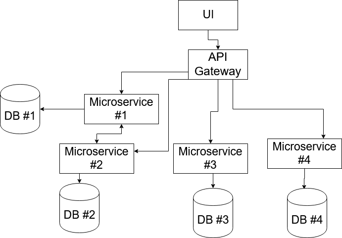

# Job advertiser

## Telepítés

Az alkalmazás futtatásához dockerre, illetve docker-composera van szükség. A projekt cloneozása után a  
```
docker-compose build
```   
parancs kiadása a projekt gyökérkönyvtárában letölti a docker szeverről a szükséges imageket, illetve buildeli az alkalmazás saját imageit. Ezután
````
docker-compose up -d
````
parancsot kiadva elindulnak a konténerek, és elérhető az alkalmazás frontendje a localhost 80-as portján.

## Használat

A webalkalmazás elindítása után bejelentkezés szükséges a használathoz, amihez google vagy github fiók szükséges. Bejelentkezés után az elérhető munkák listáját látjuk, illetve ezeknek a munkáknak az összes adatát. Más felhasználó által hirdetett munkára tudunk jelentkezni a listában "Apply" gomb segítségével. A felső navigációs sávon található linkek használatával tudunk váltani a hirdetés létrehozása oldalra, a saját jelentkezések oldara, illetve a jelentések oldalra. A jelentkezések oldalon tudjuk az elvégzett munkát értékelni, a dolgozó és a hirdető szempontjából is. A jelentések oldalon meg tudjuk tekinteni a saját hirdetéseink, értékeléseink összesítését.  
A navigációs sávon található "Logout" gombbal tudunk kijelentkezni az oldalról.

## Működés
Az alkalmazás microservice architektúrát használ, ami azt jelenti, hogy nem egy monolitikus "óriás" backend fut, ami minden kérést kiszolgál, hanem minden logikailag összetartozó kérést külön backend kezel.  
Ennek a megoldásnak több előnye is van:  
- vízszintes skálázás esetén nem szükséges az egész monolitikus alkalmazásból több példányt futtatni, elég csak azokból amikből ténylegesen több kell, amikre sok kérés érkezik
- egy-egy szolgáltatás könnyen cserélhető, nem függnek egymástól a servicek, ezért ha pl másik technológiára váltanánk, ezt könnyen megtehetjük, nem kell az egész alkalmazást újraírni, elég csak a kis önálló részt
- continuous deployment egyszerűen végrehajtható egy-egy egységen
- egy szolgáltatás kiesése esetén a többi tovább tud működni, mivel nem függnek egymástól, ezért az alkalmazásnak csak egy kis része lesz elérhetetlen, a többi hibátlanul tud tovább működni

Ezen felül persze vannak hátrányai is:  
- sokkal komplexebb lesz az alkalmazás, nehezebb a fejlesztőnek átlátni egyben az egészet
- nehezebb tesztelés, unit tesztek ugyanúgy működnek mint máshol, de egy átfogóbb teljes tesztet végezni az alkalmazáson nehezebb

Ezek megfontolásával érdemes dönteni a különböző architektúrák mellett.

### Egy általános microservice alkalmazás architektúra rajza.


## Az alkalmazásban használt technológiák

### OAuth

OAuth használatával nem kell felhasználónév illetve jelszó párossal foglalkozni az alkalmazásnak, hanem ezt a google, illetve a github kezeli. Az oldal megnyitása után két gombbal lehet bejelentkezni, és ezután a szolgáltató ad egy access tokent, és a felhasználó adatait, amivel azonosítható. Az access tokennel ellenőrizhető a session, és ha érvényes, akkor generálhat egy JWT tokent az alkalmazás, ami alapján tudja majd autentikálni a felhasználót.

### traefik

Az egyik legnépszerűbb api gateway megoldás. Minden beérkező kérést megvizsgál, és a megfelelő konténernek továbbítja. A kéréseken middlewarek használatával módosításokat is lehet végezni ezeken a kéréseken, mint pl fejlécek módosítása stb.

### rabbitmq

Bróker szolgáltatás, ami a backendek közötti aszinkron kommunikációt teszi lehetővé. Amqp protokollt használ, a küldők (producerek) queue-ba küldik az adatokat, és a fogadók (consumerek) ezekből a sorokból tudják kiolvasni.

### Docker

Az alkalmazás docker konténertechnológiát használ, ami az egyik legrégebb óta használt megoldás. A lényege, hogy egy virtuális gépként viselkedik minden konténer, de sokkal kevesebb erőforrást használva, mint egy valódi VM, ugyanis csak a megadott szolgáltatás futtatásához szükséges erőforrásokat használja ki. A legtöbb szoftverfejlesztő cég adott ki saját képfájlt az általuk fejlesztett alkalmazáshoz, (pl linux disztribúciók, adatbázisok) de mi magunk is definiálhatunk egyet. A projektben több ilyen is található, Dockerfile-okban. Ezekben van leírva, hogy a konténernek milyen alap imageből kell kiindulnia, illetve ezek után milyen parancsokat adjon ki, és mit futtasson.  

### Konténerek

- **db**  
MySQL adatbázis konténer az adatok tárolásához.  
Technológia: MySQL

- **mongo**  
MongoDB adatbázis konténer amit jelenleg csak a report microservice használ.  
Technológia: MongoDB

- **ad**  
A hirdetések kezeléséért felelős backend, az adatokat a db konténer adatbázisban tárolja.  
Technológia: NodeJS

- **registration**  
A jelentkezések kezeléséért felelős backend, az adatokat a db konténer adatbázisában tárolja.
Technológia: NodeJS

- **review**  
Az értékelések kezeléséért felelős backend, az adatokat a db konténer adatbázisában tárolja.
Technológia: NodeJS

- **report**  
Az alkalmazás által összegyújtött adatok összegzéséért felelős konténer, az adatokat a mongo konténer adatbázisában tárolja.  
Technológia: .NET Core 6

- **auth**  
Az alkalmazás authentikációjárét felelős backend, minden beérkező kérést megvizsgál, és csak akkor engedi tovább a tényleges cél servicenek, ha érvényes JWT token szerepel a kérés fejlécében. Ha nem szerepel benne, vagy lejárt a token, akkor visszadobja a kérést 401 unauthorized válasszal. A felhasználók adatait a db konténer adatbázisában tárolja.
Technológia: NodeJS

- **frontend**  
Az alkalmazás megjelenéséért felelős konténer, egy Single Page Application amit egy nginx szolgál ki  
Technológia: React+nginx

- **traefik**  
Az alkalmazás api gateway-e, minden beérkező kérést a megfelelő útvonalon továbbít, illetve middlewarek segítségével további műveleteket végez rajta. Az útvonalakat a konténerekkel a docker-compose fájlban konténereknek megadott labelek segítségével köthetjük össze. Ugyanilyen labellel lehet pl az adott service portszámát is megadni, mint jelen projektnél a frontend a 81-es porton fut. Labelben lehet még definiálni, illetve servicekhez hozzárendelni middlewareket, az alkalmazás forward auth middlewaret használ, ami az autentikációt végzi el minden beérkező kérés esetén.  
Technológia: traefik

- **rabbitmq**  
Bróker szolgáltatás, ami az aszinkron kommunikációt teszi lehetővé a microservicek között. Az összes szolgáltatás ami adatokat tárol továbbítja a releváns információkat ennek a konténernek, és a report pedig consumerek segítségével kiolvassa ezeket.  
Technológia: rabbitmq